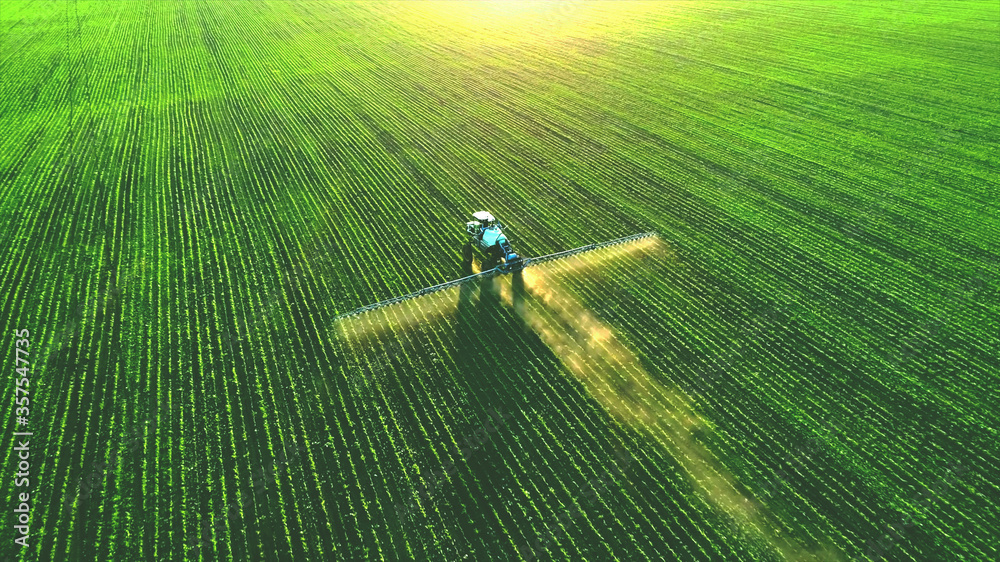
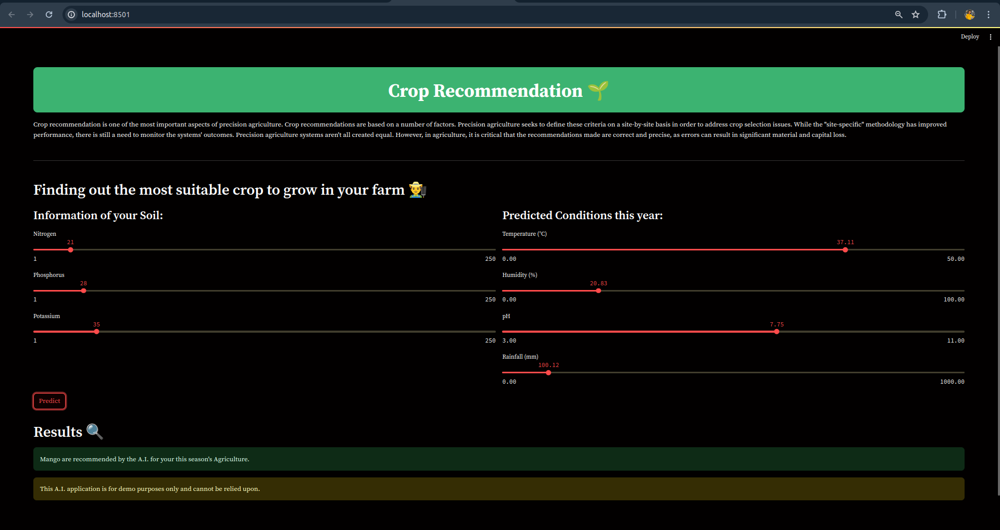

Small working prototype of loca Streamlit App. Here we use soil and climate parameters and trained it using lightBGM method to predict optimal crop for the season.

Prototype Runned on local Streamlit App.

